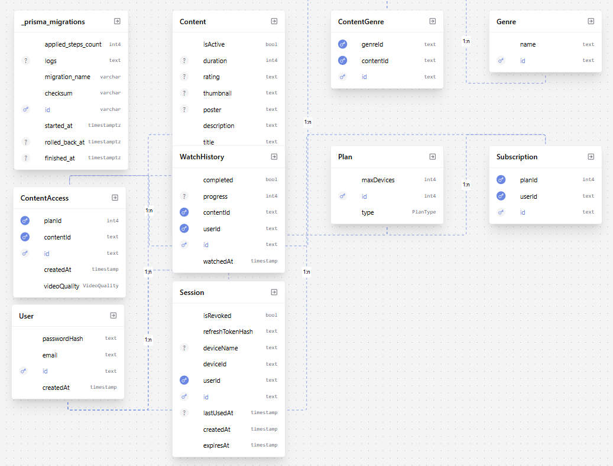

# Auth Service OTT Platform

A subscription-based content backend (Netflix-style) built with Node.js, PostgreSQL (Prisma ORM), and Redis for session and caching. It enforces plan-based concurrent screen limits, supports multi-device sessions, secure JWT rotation, token reuse prevention, and robust rate limiting.

## Vision

- Deliver secure authentication, session management, and subscription-aware content access.
- Enforce plan rules (max devices) while keeping UX seamless across web and mobile.
- Provide a clean API surface for frontend teams with clear token handling.

## Core Features

- Multi-device login with plan-based screen limits (FREE/BASIC/PREMIUM/ULTRA_PREMIUM).
- Session control: logout from current device and global logout from all devices.
- Secure auth: short-lived Access Token (JWT), long-lived Refresh Token with rotation and reuse prevention.
- Redis-backed cache and session lookups for performance and scalability.
- Rate limiting: global, auth-specific (brute-force), and content browsing.

## Tech Stack

- Runtime: Node.js + Express
- Database: PostgreSQL via Prisma Client
- Cache/Session: Redis
- Security: Helmet, express-rate-limit, JWT (HS256)
- Containerization: Docker + Compose (optional)

## Setup

### Prerequisites

- Node.js 18+ (or Docker)
- PostgreSQL 14+ (local or cloud)
- Redis 6+

### Environment Variables

Create `.env` (or use `.env.docker`) with:

- `PORT`: API port (default: 3000)
- `NODE_ENV`: `development` or `production`
- `DATABASE_URL`: PostgreSQL connection string
- `JWT_ACCESS_TOKEN_SECRET`: HS256 secret for Access Tokens
- `REDIS_URL`: Redis connection string (supports password)
- Optional TLS:
    - `REDIS_TLS_CA_CERT`: path to CA cert
    - `REDIS_TLS_CERT`: path to client cert
    - `REDIS_TLS_KEY`: path to client key
    - `DISABLE_TLS_VERIFY`: `true` to allow self-signed (development)
    - `NODE_EXTRA_CA_CERTS`: path to extra trusted CA bundle

### Install & Run (Local)

```bash
npm install
npx prisma migrate dev
npm run dev
```

Health check: `GET /health` → `{ "status": "ok" }`

### Docker (Optional)

```bash
docker compose --env-file .env.docker up --build
```

The compose file brings up Postgres, Redis, and the app. On first run, migrations and seed will execute.

### Project Scripts

- `npm run dev`: Start in dev mode (ts-node or nodemon depending on setup)
- `npm run build && npm start`: Build and run compiled app
- `npm run test`: Run tests (Vitest)

## Directory Structure (Key)

- `src/app.ts`: Express app, routes, security
- `src/index.ts`: Server entry
- `src/routes/*`: Route definitions
- `src/controllers/*`: Request handlers
- `src/middlewares/*`: Auth + rate limiting
- `src/services/*`: DB/Redis logic
- `prisma/schema.prisma`: Data models

## Notes

- Access Tokens expire in ~15 minutes; refresh via `/api/auth/refresh`.
- Redis is used for session caching and subscription/content cache-aside patterns.
- Plan changes invalidate relevant Redis keys for correctness.

## Architecture Diagrams

Below is the database ER diagram used by this service. Save the image to `docs/images/er.png` to render it:



For a deeper architecture explanation (API, Redis strategy, security, and flows), see the full design document.

## Documentation

- Design: [DESIGN.md](docs/DESIGN.md)
- API & Integration Guide: [USER.md](docs/USER.md)
